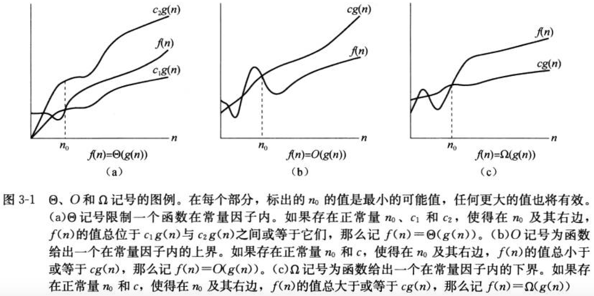
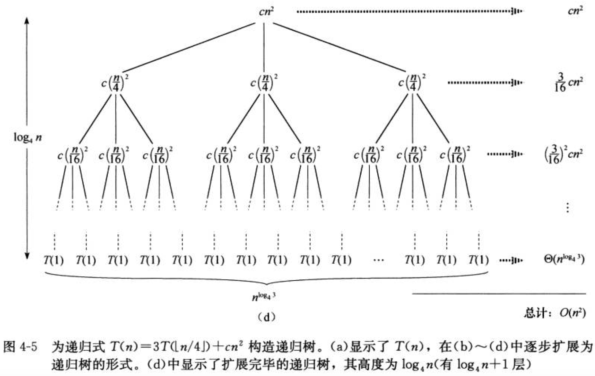

# Code_Play

Programming Practice - ACM Algorithm

By [YuweiYin](https://github.com/YuweiYin)

## 目录

- [数据结构 Data Structure](./data_structure/)
- [排序 Sort](./sort/)
- [搜索 Search](./search/)
- [分治法 Divide & Conquer](./divide_conquer/)
- [动态规划 Dynamic Programming](./dynamic_programming/)
- [图论 Graph Theory](./graph_theory/)
- [数学 Mathematics](./mathematics/)
- [其它主题 Other Topics](./other-topics/)

## 1. 算法

非形式地说，**算法** (algorithm) 就是任何良定义的计算过程，该过程取某个值或值的集合作为**输入**并产生某个值或值的集合作为**输出**。这样算法就是把输入转换成输出的计算步骤的一个序列。

也可以把算法看成是用于求解良说明的**计算问题**的工具。一般来说，问题陈述说明了期望的输入/输出关系，算法则描述一个特定的计算过程来实现该输入/输出关系。

解决同一个问题，也会有很多算法可供使用。在实际应用中，算法的选择往往要考虑多个方面。以排序算法为例，对于给定的应用，哪个排序算法更好依赖于以下因素：待排序的数据项数、这些项已被部分排序的程序、关于项值的可能限制、计算机的体系结构，以及将使用的存储设备的种类（主存、磁盘、固态硬盘、磁带...）。

若某算法对每个输入实例都以正确的输出**停机**，则称该算法**正确的**。不正确的算法对某些输入实例可能以不正确的输出停机，也可能根本不停机。不过有时候，对某些不正确的算法而言，只要其错误率是可控的或者极小的，那么此算法可能也是有用的。

算法可以用自然语言或伪代码表达，也可以写成计算机程序，甚至可以用硬件设计来说明。唯一的要求是这个说明必须精确描述所要遵循的计算过程。

### 1.1. 算法的正确性

通常用**循环不变式**来证明算法的**正确性**。它类似于数学归纳法：

1. 初始：首先给出一种数据的性质，称为**不变式**，该性质应对输入数据适用。
2. 保持：然后证明每一段（循环迭代 or 递归调用）算法过程仍然能够维持此不变式性质。
3. 终止：最后证明在此算法结束时，确实能够获得预期输出。

对于简单清晰的算法，正确性的判断是比较显然而容易的。但是对于复杂精巧的算法，往往需要拆开成好几个部分，利用循环不变式严格地证明各个部分的正确性，以及整体算法的正确性。

### 1.2. 算法的效率

计算机也许是快的，但不是无限快的；存储器也许是廉价的，但不是免费的。所以计算时间是一种有限资源，存储器中的空间也一样。开发者应该明智地使用、权衡这些资源，设计时间或空间方面有效的算法。

### 1.3. 算法的分析

分析算法的结果意味着预测算法需要的资源。虽然有时候主要关心内存、通信带宽或计算机硬件这类资源，但通常真正想度量的是总计算时间。通过分析求解某个问题的几种候选算法，通常可以选出一种/一些最有效的算法。

在能够分析一个算法之前，必须要有一个实现技术的计算模型，包括描述所用的资源及其代价的模型。在分析设计时，通常假定一种通用的单处理器计算模型——随机访问机 (Random-Access Machine, RAM)，算法可以用计算机程序来实现。在 RAM 模型中，指令一条接一条（根据程序计数器 PC）地执行，没有并发操作，也不考虑并行计算（现代计算机 CPU 往往是多核 Multi-Core）和分布式计算。

对存储空间进行分析时，往往不考虑高速缓存 cache（现代计算机往往至少有两级高速缓存 L1 cache、L2 cache）和虚拟内存（可以视作为主存与外存之间的缓存）。

因此，对算法的时间、空间效率的理论分析往往是在一个比价高的抽象层次。而在具体实现时，一个算法是否真的在实际运行时比另一个算法好，是要看具体情况的。但理论分析具有指导意义。

算法的**输入规模**这个概念依赖于研究的问题。对许多问题，如排序或计算离散傅立叶变换，自然是用*输入中的项数*来度量输入规模，例如待排序数组中的数据量 n。对于其它许多问题，如两个整数相乘，输入规模的最佳度量是用二进制记号表示输入的所需的总位数。有时，用两个数而不是一个数来描述输入规模可能更合适：例如，若某个算法的输入是一个图结构，则输入规模可以用该图中的顶点数 V 和边数 E 来描述。

一个算法在特定的输入上的**运行时间**是指执行的**基本操作数**或步数。对“步”的概念通常做如下假定：执行每行伪代码需要常量时间。当然，如果某一行是调用某个子过程，那么耗费的就不一定是常数时间了。但定义“步”的概念就是为了独立于机器，所以通常站在更高的抽象层次来看待。如果要细究具体的机器执行时间，则需要考虑算法程序对应的机器指令，以及本机的时钟周期等方面。

### 1.4. 最坏情况与平均情况分析

最坏情况运行时间，即对规模为 $n$ 的任何输入，算法的最长运行时间。分析最坏情况往往有如下意义：

- 一个算法的最坏情况运行时间给出了任何输入的运行时间的一个上界。
- 对某些算法，最坏情况经常出现。例如，当在数据库中检索一条特定的信息时，若该信息未存储在数据库中，则检索算法往往会出现最坏情况。在某些应用中，对缺失信息的检索可能是频繁的。
- “平均情况”往往与最坏情况大致一样差（渐近时间复杂度相同）。而且有时候难以确定什么样的情况才是此算法的平均情况。

另外，可以使用**概率分析**技术来分析算法的运行时间。平均情况分析的范围有限，因为对于特定问题，什么构成一种“平均”输入并不明显。为了进行分析，常常假定给定规模的所有输入具有相同的可能性出现。实际上，该假设可能不成立，但有时可以使用随机化算法，该算法做出一些随机的选择，以允许进行概率分析并产生某个**期望**的运行时间。

### 1.5. 增长量级

一般来说，真正感兴趣的是运行时间的**增长率**或**增长量级**，因此我们主要考虑的是运行时间公式 $T(n)$ 中 (关于输入规模 $n$) 最高阶的项。例如 $n^2 > n \log n > n > \log n > \log \log n$。注意：在计算机算法的分析时，若无特别说明，$log$ 或者 $lg$ 往往表示以 $2$ 为底的对数 $\log_{2}$。

如果一个算法的最坏情况运行时间具有比另一个算法更低的增长量级，则通常认为前者比后者更有效率。

## 2. 函数的增长

前述算法的运行时间增长量级简单地刻画了算法效率，一旦输入规模 $n$ 变得足够大，最坏运行时间 $T(n)$ 中最高阶为 $n \log n$ 的算法总能战胜最高阶为 $n^2$ 的算法。虽然有时可以确定 $T(n)$ 中的低阶项以及最高阶项的常数系数，但对于足够大的输入，这些量会被输入规模本身的影响所支配。

当输入规模足够大，使得只有运行时间的增长量级有关时，对算法效率的研究就主要是研究其**渐近效率**。即：关心当输入规模**无限增加**时，在**极限**情况下，算法的运行时间如何随着输入规模的变大而增加。以微积分的观点看来，由于(通常)算法的运行时间不会是负数，所以 $T(n)$ 都是**无穷大量**，而相对**更低阶**的无穷大量 是拥有**更高效率**的算法。

### 2.1. 渐近记号

由于数据的输入规模 $n$ 往往是一个自然数，因此用来描述算法渐近运行时间的记号是根据定义域为自然数集 $\mathbb{N} = \{ 0, 1, 2, ... \}$ 的函数来定义的。渐近记号除去了算法运行时间函数的某些细节（低阶项、最高阶项的系数）。

$\Theta$ 、$O$、$o$、$\Omega$、$\omega$ 记号，分别表达**渐近紧确界** (Asymptotically Tight Bound)、渐近上界、非紧确渐近上界、渐近下界、非紧确渐近下界。

- $\Theta(g(n)) = \{ f(n): \exists c_1, c_2, n_0 > 0, \forall n \geq n_0: 0 \leq c_1 g(n) \leq f(n) \leq c_2 g(n) \}$
- $O(g(n)) = \{ f(n): \exists c, n_0 > 0, \forall n \geq n_0: 0 \leq f(n) \leq c g(n) \}$
- $o(g(n)) = \{ f(n): \exists c, n_0 > 0, \forall n \geq n_0: 0 \leq f(n) < c g(n) \}$
- $\Omega(g(n)) = \{ f(n): \exists c, n_0 > 0, \forall n \geq n_0: 0 <= c g(n) <= f(n) \}$
- $\omega(g(n)) = \{ f(n): \exists c, n_0 > 0, \forall n \geq n_0: 0 <= c g(n) < f(n) \}$

可分别类比于相等关系和偏序关系的符号：$=, \leq, <, \geq, >$。因此各种渐近符号的性质也很显然了（下面假定 $f(n)$ 和 $g(n)$ 均渐近为正）：

**传递性**

- $f(n) = \Theta(g(n)) \land g(n) = \Theta(h(n)) \Rightarrow f(n) = \Theta(h(n))$
- $f(n) = O(g(n)) \land g(n) = O(h(n)) \Rightarrow f(n) = O(h(n))$
- $f(n) = o(g(n)) \land g(n) = o(h(n)) \Rightarrow f(n) = o(h(n))$
- $f(n) = \Omega(g(n)) \land g(n) = \Omega(h(n)) \Rightarrow f(n) = \Omega(h(n))$
- $f(n) = \omega(g(n)) \land g(n) = \omega(h(n)) \Rightarrow f(n) = \omega(h(n))$

**自反性**

- $f(n) = \Theta(f(n))$
- $f(n) = O(f(n))$
- $f(n) = \Omega(f(n))$

**对称性**

- $f(n) = \Theta(g(n)) \Leftrightarrow g(n) = \Theta(f(n))$

**转置对称性**

- $f(n) = O(g(n)) \Leftrightarrow g(n) = \Omega(f(n))$
- $f(n) = o(g(n)) \Leftrightarrow g(n) = \omega(f(n))$

**三歧性**

对任意两个实数 $a$ 和 $b$，下列三种情况**恰有** (有且仅有) 一种成立：$a < b$; $a = b$; $a > b$。

虽然任意两个实数都可以进行比较（实数上的序关系是全序关系），但不是所有函数都可以渐近比较。即：对两个函数 $f(n)$ 和 $g(n)$ 而言，可能 $f(n) = O(g(n))$ 和 $f(n) = \Omega(g(n))$ 均不成立。

例如，不能用渐近记号来比较函数 $f(n) = n$ 和 $g(n) = n^(1 + \sin(n))$，因为 $g(n)$ 中的幂值在 $0$ 与 $2$ 之间摆动、取介于两者之间的所有值。不过，好在一般很少遇到这种特殊的运行时间表达式。$T(n)$ 一般都是多项式函数与对数函数的组合，偶尔会出现指数函数和阶乘函数（此二者往往导致算法运行时间随输入规模的增长而剧烈增长，应尽量避免）。

正整数 $n$ 的阶乘可以根据 斯特林公式 (Stirling's Approximation) 来近似：

$$n! = \sqrt{2n \pi} (n/e)^{n} (1 + 1/O(n))$$

## 3. 递归式

对含有递归结构的算法进行运行时间分析时，常使用**递归式**来表达问题。

例如，归并排序的每次将当前数据规模 $k$ 的问题分解为 $2$ 个数据规模为 $k/2$ 的子问题，并耗费 $\Theta(k)$ 的时候将子问题的结果合并起来。因此归并排序的递归式为 $T(k) = 2 T(k/2) + \Theta(k)$。顶层调用为输入规模 $k=n$

求解递归式一般有三种方式：代入法、递归树、主方法。

### 3.1. 代入法

基于经验和数学直觉，对于比较简单的递归式形式可以采用代入法，步骤如下：

1. 猜测解的形式，存在待定系数
2. 用数据归纳法求解出待定系数，并证明解是正确的。
	- 注意：归纳假设要足够严格，覆盖所有可能的情况，否则可能是错误的证明。

### 3.2. 递归树

如果算法含有递归结构，则往往可以将其**递归树**表达出来，每次递归调用则产生一个孩子结点。

将树每层子过程（一个结点一个子过程）的运行时间加和起来，便能得到总运行时间 $T(n)$。

一般来说，加和后的式子会比较凌乱，此时可以利用渐近符号的“不精确性”，用一些放缩法（比如利用某无限递减的几何级数作为上界）来整理原式，得到一个**猜测** $T(n)$。此时再利用代入法，验证此 $T(n)$ 的正确性。

原式是紧确界，而经过放缩法整理的式子可能会导致 $T(n)$ 的渐近界发生变化（当然，这是不希望出现的），因此整理后的式子只能被称作是猜测，需要代入法来验证。

### 3.3. 主方法

**主定理**：令 $a \geq 1$ 和 $b > 1$ 是常数，$f(n)$ 是一个渐近为正的函数，$T(n)$ 是定义域为自然数集的递归式：

$$T(n) = a T(n/b) + f(n)$$

这里将 $n/b$ 解释为上取整 $\lceil n/b \rceil$ 或下取整 $\lfloor n/b \rfloor$。则 $T(n)$ 有如下渐近界：

1. 若对某个常数 $\epsilon > 0$，有 $f(n) = O(n^{(log_{b} a) - \epsilon})$，则 $T(n) = \Theta(n^{log_{b} a})$
2. 若 $f(n) = \Theta(n^{log_{b} a})$，则 $T(n) = \Theta(n^{log_{b} a} log n)$
3. 若对某个常数 $ \epsilon > 0 $，有 $f(n) = \Omega(n^{(log_{b} a) + \epsilon})$，且对某个常数 $c < 1$ 和所有足够大的 $n$ 有 $a f(n/b) \leq c f(n)$，则 $T(n) = \Theta(f(n))$

**解释**：对于三种情况的每一种，将函数 $f(n)$ 与函数 $g(n) = n^{log_{b} a}$ 进行比较，两大函数的较大者决定了递归式的解。

- 对于情况 1，$g(n)$ 渐近较大，则解为 $T(n) = \Theta(g(n))$
- 对于情况 2，两者渐近相等，则在 g(n) 的基础上乘以一个对数因子，解为 $T(n) = \Theta(g(n) log n)$
- 对于情况 3，$f(n)$ 渐近较大，则解为 $T(n) = \Theta(f(n))$

**注意**：这三种情况并没有把所有可能出现的 case 都覆盖，存在一些“间隙”，使得主定理无法适用。

- 情况 1 和情况 2 之间有间隙：$f(n)$ 可能小于 $g(n)$，但不是渐近小于 $g(n)$。
- 情况 2 和情况 3 之间有间隙：$f(n)$ 可能大于 $g(n)$，但不是渐近大于 $g(n)$。
- 如果函数 $f(n)$ 落在上述两种间隙中，或者情况 3 中要求的正则条件不满足，就不能用主定理来解递归式。

**应用举例**

对归并排序的递归式 $T(n) = 2 T(n/2) + \Theta(n)$ 应用主定理。$a = 2$、$b = 2$、$f(n) = \Theta(n)$，因此 $g(n) = n^{log_{b} a} = n^{log_{2} 2} = n$。所以 $f(n)$ 渐近等于 $g(n)$，属于情况 2，得到递归式的解为 $T(n) = \Theta(g(n) log n) = \Theta(n log n)$。

## 4. 数据结构

**数据结构**是一种存储和组织数据的方式，旨在便于**访问**和**修改**数据。没有哪一种数据结构是万能的，所以重要的是理解各个结构的本质、清楚其优势和局限所在。

**集合**作为计算机科学的基础，就如同它们在数学中所起的作用。数学中的集合往往是不变的，而由算法操作的集合却在整个过程中能增大、缩小或发生其它变化，这样的集合常被称为**动态集合**。

不同的算法可能需要对集合执行不同的操作。例如，许多算法只需要能在一个集合中插入和删除元素，以及测试元素是否属于集合。支持这些操作的动态集合称为**字典** (dictionary)。其它一些算法需要更复杂的操作，例如用堆数据结构实现的最小(最大)优先队列，它支持(高效地)向集合插入一个元素和取出一个最小元素的操作。实现动态集合关键取决于想要在此集合上(高效)实现的操作。

### 4.1. 动态集合的元素

在动态集合的典型实现中，每个元素都有一个对象来表示，如果有一个指向对象的指针，就能对其各个属性进行检查和操作。（有的编程语言不支持指针和对象数据类型，可以利用数组和数据下标来构造对象和指针）

一些类型的动态集合假定对象中的一个属性为标志**关键字** (key)。如果关键字全部不同，可以将动态集合视为一个关键字值的集合。对象可能包含**卫星数据** (satellite data)，它们与其它对象属性一起随对象而移动。卫星数据可以视作为该数据结构中某关键字 key 对应的值对象 val (value)，

一些动态集合以其关键字来自于某个全序集为前提条件，比如实数集、整数集、自然数集，或者按通常字典序排序的所有单词。

### 4.2. 动态集合上的操作

动态集合上的操作可以分为两类：简单返回有关集合信息的**查询操作**和改变集合(信息或集合结构)的**修改操作**，比如如下常见操作（这里的“全序集 S”均指集合 S 中元素的关键字 `x.key` 是全序的）：

- **搜索** `search(S, k)` 属于查询操作
	- 给定一个集合 S 和关键字 k，返回指向 S 中某个元素的指针 x，使得 `x.key = k`；
	- 如果 S 中没有这样的元素，则返回 `NIL` 空指针。
- **插入** `insert(S, x)` 属于修改操作
	- 将由 x 指向的元素加入到集合 S 中。
	- 通常假定元素 x 中 集合 S 所需要的每个属性（比如 `x.key`）都已经被初始化好了。
	- 一般而言，插入成功返回布尔值 `True`；插入失败则返回布尔值 `False`。
- **删除** `delete(S, x)` 属于修改操作
	- 给定指针 x 指向集合 S 中的一个元素，从 S 中删除 x。
	- 或者是给定一个关键字 k，从集合 S 中删除关键字 `key == k` 的元素，即 `delete(S, k)`。
	- 一般而言，插入成功返回布尔值 `True` (或者被删的元素 x)；删除失败则返回布尔值 `False` (或者 `NIL` 空指针)。
- **最小值** `minimum(S)` 属于查询操作
	- 在全序集 S 上返回一个指向 S 中具有最小关键字的元素 (的指针)。
	- 查询失败 (比如集合 S 为空) 则返回 `NIL` 空指针。
- **最大值** `maximum(S)` 属于查询操作
	- 在全序集 S 上返回一个指向 S 中具有最大关键字的元素 (的指针)。
	- 查询失败 (比如集合 S 为空) 则返回 `NIL` 空指针。
- **后继** `successor(S, x)` 属于查询操作
	- 在全序集 S 上返回比 x 大的后一个元素 (的指针)。
	- 查询失败 (比如集合 S 为空，或者 x 已是最大元素) 则返回 `NIL` 空指针。
	- 也可以直接根据关键字 k 来查找后继，即 `successor(S, k)`。
- **前驱** `predecessor(S, x)` 属于查询操作
	- 在全序集 S 上返回比 x 小的前一个元素 (的指针)。
	- 查询失败 (比如集合 S 为空，或者 x 已是最小元素) 则返回 `NIL` 空指针。
	- 也可以直接根据关键字 k 来查找前驱，即 `predecessor(S, k)`。

在 `delete`、`successor`、`predecessor` 操作中，如果传入的参数是关键字 k 而不是元素对象 x，需保证此数据结构能够较好地支持 `search(S, k)` 搜索操作，否则这三个操作也会变的低效。例如：堆 Heap 数据结构往往就不能较好地支持 `search(S, k)` 操作。

### 4.3. 摊还分析

**摊还分析** (Amortized Analysis)

- **聚合分析**
- **核算法**
- **势能法**
- **动态表**
