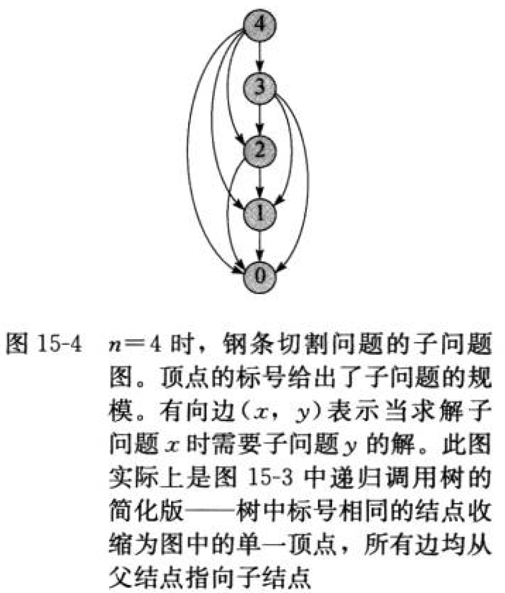

# Code_Play

Programming Practice - ACM Algorithm - Dynamic Programming

By [YuweiYin](https://github.com/YuweiYin)

## 目录

- 四边形不等式理论
- 不完全状态记录
	- 青蛙过河问题
	- 利用区间 DP
- 背包类问题
	- 0-1 背包 (经典问题)
	- 无限背包 (经典问题)
	- 判定性背包问题
	- 带附属关系的背包问题
	- +/-1 背包问题
	- 双背包求最优值
	- 构造三角形问题
	- 带上下界限制的背包问题 (012背包)
- 线性的动态规划问题
	- 积木游戏问题
	- 决斗（判定性问题）
	- 圆的最大多边形问题
	- 统计单词个数问题
	- 棋盘分割
	- 日程安排问题
	- 最小逼近问题 (求出两数之比最接近某数 / 两数之和等于某数等等)
	- 方块消除游戏 (某区间可以连续消去求最大效益)
	- 资源分配问题
	- 数字三角形问题
	- 漂亮的打印
	- 邮局问题与构造答案
	- 最高积木问题
	- 两段连续和最大
	- 2 次幂和问题
	- N 个数的最大 M 段子段和
	- 交叉最大数问题
- 判定性问题的 DP (如判定整除、判定可达性等)
	- 模 K 问题的 DP
	- 特殊的模 K 问题，求最大(最小)模 K 的数
	- 变换数问题
- 单调性优化的动态规划
	- 1-SUM 问题
	- 2-SUM 问题
	- 序列划分问题 (单调队列优化)
- 剖分问题 (多边形剖分/石子合并/圆的剖分/乘积最大)
	- 凸多边形的三角剖分问题
	- 乘积最大问题
	- 多边形游戏 (多边形边上是操作符，顶点有权值)
	- 石子合并 (N^3 / N^2 / NLogN 各种优化)
- 贪心的动态规划
	- 最优装载问题
	- 部分背包问题
	- 乘船问题
	- 贪心策略
	- 双机调度问题 Johnson 算法
- 状态 DP
	- 牛仔射击问题(博弈类)
	- 哈密顿路径的状态 DP
	- 两支点天平平衡问题
	- 一个有向图的最接近二部图
- 树型 DP
	- 完美服务器问题 (每个节点有 3 种状态)
	- 小胖守皇宫问题
	- 网络收费问题
	- 树中漫游问题
	- 树上的博弈
	- 树的最大独立集问题
	- 树的最大平衡值问题
	- 构造树的最小环

## 动态规划

- 动态规划基础
	- [连续子数组的最大和](./max-subarray-sum.py)
	- [钢条切割](./cut-rod.py)
	- [矩阵链乘法](./matrix-chain-order.py)
	- [最长公共子序列](./longest-common-subsequence.py)
	- [最优二叉搜索树](./optimal-binary-search-tree.py)
- 《CLRS》 Chapter 15 思考题
	- 有向无环图中的最长简单路径
	- 最长回文子序列
	- 双调欧几里得旅行商问题
	- 整齐打印
	- 编辑距离
	- 公司聚会计划
	- 译码算法
	- 基于接缝裁剪的图像压缩
	- 字符串拆分
	- 投资策略规划
	- 库存规划
	- 签约棒球自由球员

**动态规划** (Dynamic Programming, DP) 与分治法相似，都是通过组合子问题的解来求解原问题。注意，“Dynamic Programming”里的 Programming 指的是一种**表格法**，而非编写计算机程序。

**分治法**将问题划分为**互不相交的子问题**，递归地求解子问题 直到易于求解的基本情况，再将子问题的解组合起来，求出原问题的解。与之相反，动态规划应用于**子问题重叠**（难以拆解子问题使得它们之间没有相互依赖）的情况，即不同的子问题具有一些公共的“子子问题”。

在这种情况下，如果选择分治算法，那么分治法往往会做出许多不必要的工作，比如反复求解那些公共子问题。而动态规划算法**对每个子问题只求解一次**，将其**保存在一个表格中**，从而无需每次求解一个子子问题时都要重新计算。往往能将指数级别的计算时间复杂度降到多项式级别。(0 维 DP 用一个标量，1 维 DP 用一个数组、2 维 DP 用一个矩阵/二维数组)

动态规划方法通常用来求解**最优化问题** (Optimization Problem)。这类问题可以有很多可行解，每个解都有一个值，目标往往是寻找具有**最优值** (某特性的最小值或最大值) 的解，被称为问题的**一个最优解** (an optimal solution)，而不是最优解 (the optimal solution)，因为可能有多个解都达到了最优值。

注意，“解”和“值”往往是不同的。比如，在图论问题里，某个可行解/最优解可能是某一条路径 (结点的有序序列)，而对应的值/最优值可能是这条路径的总加权和。

- 有时候问题只需要给出最优值，有时候需要把最优值和最优解都给出来。
- 另外，可能有多个最优解对应了问题的最优值。有时候问题要求把这些所有最优解都求出来。

通常按照如下 4 个步骤来设计一个动态规划算法：

1. 刻画一个最优解的结构特征。（拆分子问题 并分析子问题间的关联依赖）
2. 递归地定义最优解的值。（动态规划 状态转移方程）
3. 计算最优解的值(最优值)。（通常采用自底向上的方法）
4. 利用计算出的(表格中的)信息(回溯地)构造一个最优解。

如果仅需最优值，可以忽略第 4 步。如果确实需要第 4 步，有时就需要在执行第 3 步的过程中维护一些额外信息，以便用来构造一个最优解。

而且一般来说，如果问题只求最优值、无需求解最优解，那么 DP 表格往往可以减少一个维度。比如原本需要一个二维数组才能回溯求解出最优解，如果不需要求最优解，一维数组就够求出最优值了（原理：覆盖掉那些不再使用的表格信息）。

### 子问题图

分析动态规划问题时，由于子问题之间存在依赖关系，所以要对此依赖关联进行分析。

问题的**子问题图**表达了子问题之间的依赖关系。它是一个有向图，每个顶点唯一地对应一个子问题 (也对应于递归树中的结点)。若求解子问题 x 的最优解/值时需要直接用到子问题 y 的最优解/值，那么在子问题中就会有一条从 x 到 y 的有向边。

以 [钢条切割](./cut-rod.py) 问题为例，有如下子问题图：

自底向上的动态规划方法处理子问题图中顶点的顺序为：对于一个给定的子问题 x，在求解它之前求解邻接至它的所有子问题（邻接关系是单向的）。用图论中的术语来说，自底向上动态规划算法是按 **逆拓扑序** (Reverse Topological Sort) 或 **反序的拓扑序** (Topological Sort of the Transpose) 来处理子问题图中的顶点。也即：对于任何子问题 x，直至它依赖的所有子问题均已求解完成，x 才会被求解。

往往可以用带**备忘录**的 **深度优先搜索** (Depth-First Search) 自顶向下动态规划算法处理子问题图的顺序。

子问题图 G=(V, E) 的规模可以帮助分析确定动态规划算法的运行时间。由于每个子问题只求解一次，因此算法运行时间等于每个子问题求解时间之和。通常，一个子问题求解时间与子问题图中对应顶点的 degree **度** (出射边的数目) 成正比，而子问题的数目等于子问题图中的顶点数。因此，通常情况下，动态规划算法的运行时间与顶点和边的数量呈线性关系。

## 动态规划原理

适合应用动态规划方法求解的最优化问题应该具备两个要素/性质：**最优子结构**、**重叠子问题**。

### 最优子结构

用动态规划方法求解最优化问题的第一步就是刻画最优解的结构。如果一个问题的最优解包含(蕴含)其子问题的最优解，就称此问题具有**最优子结构性质**。当然，具有最优子结构性质的问题 可能也适合用贪心算法求解。

使用动态规划方法时，用子问题的最优解来构造原问题的最优解，因此需要确保考察了最优解中用到的所有子问题。

在发掘最优子结构性质的过程中，往往遵循了如下的通用模式：

1. 证明问题最优解的**第一个组成成分是做出一个选择**。
	- 例如，钢条切割问题中选择第一次切割的位置，矩阵链乘问题中选择矩阵链的第一次划分位置等。
	- 做出这次选择会产生一个或多个待解的(可能不同规模的)子问题。
2. 对于一个给定问题，在其可能的第一步选择中，**假定已经知道哪种选择才会得到最优解**。
3. 给定可获得最优解的选择后，确定这次选择**会产生哪些子问题**，以及如何**最好地刻画子问题空间**。
4. 利用“**剪切-粘贴**” (cut-and-paste) 技术证明：作为构成原问题最优解的组成成分，**每个子问题的解就是子问题本身的最优解**。
	- 证明这一点往往是利用**反证法**：假定子问题的解不是其自身的最优解，那么就可以从原问题的解中“剪切”掉这些非最优解，将最优解“粘贴”进去，从而得到原问题的一个更优的解，这与“最初的解是原问题最优解”的前提假设 相矛盾。
	- 如果原问题的最优解包含多个子问题，通常他们都很相似，可以将针对某一个子问题的“剪切-粘贴”论证方法稍加修改，用于其它子问题。

一个刻画子问题空间的好经验是：**保持子问题空间尽可能简单，只在必要时才扩展它。**

对于不同问题领域，最优子结构的不同体现在两个方面：

1. 原问题的最优解中涉及多少个子问题
2. 在确定最优解使用哪些子问题时，需要考察多少种选择

例如，钢条切割问题的最优切割方案仅使用一个子问题（长度为 n-i 的子钢条的最优切割问题），但必须要考察 i 的 n 种不同取值，来确定哪一个 i 会产生最优解。而在矩阵链乘问题中，最优解使用两个子问题（被 k 切分的两部分），而且两个子问题都必须求解最优方案。一旦确定了子问题的最优解，就可以在 j-i 个候选的 k 值中选取最优者。

可以用子问题的总数 和 每个子问题需要考察多少种选择 这两者的乘积来粗略分析动态规划算法的运行时间。对于钢条切割问题，共有 $ \Theta(n) $ 个子问题，每个子问题最多需要考察 n 种选择，因此运行时间为 O(n^2)。矩阵链乘问题共有 $ \Theta(n^2) $ 个子问题，每个子问题最多需要考察 n-1 种选择，因此运行时间为 O(n^3)。

子问题图也可以用来做同样的分析。图中每个顶点对应一个子问题，而该子问题需要考察的选择数目 对应关联到该顶点的边数。

在动态规划方法中，通常**自底向上**地使用最优子结构。首先求得子问题的解，然后求原问题的解。

### 重叠子问题

## 贪心算法

- 贪心算法基础
	- 活动选择问题
	- 哈夫曼编码
	- 拟阵及任务调度问题

贪心算法和动态规划最大的不同在于：贪心算法并不是首先寻找子问题的最优解，然后在其中进行选择，而是首先做出一次“贪心”选择（在当前情况/局部 看来最优的选择），然后再求解选出的/剩余的子问题，从而贪心算法不必费心求解所有可能的相关子问题。

对于某些问题，贪心算法能得到最优解；对某些问题，贪心算法不一定得到最优解，但比较可能得到一个较好的解；而有的时候，贪心算法得到的解是很差的。因此需要先对贪心算法的适用场景、问题的**贪心性质**进行分析。
