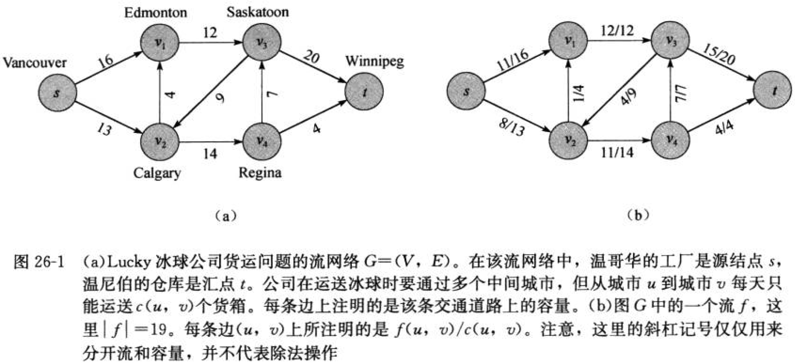
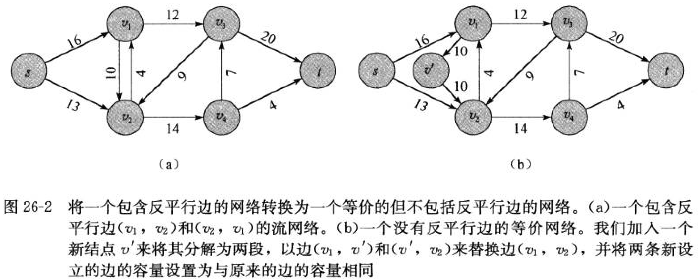
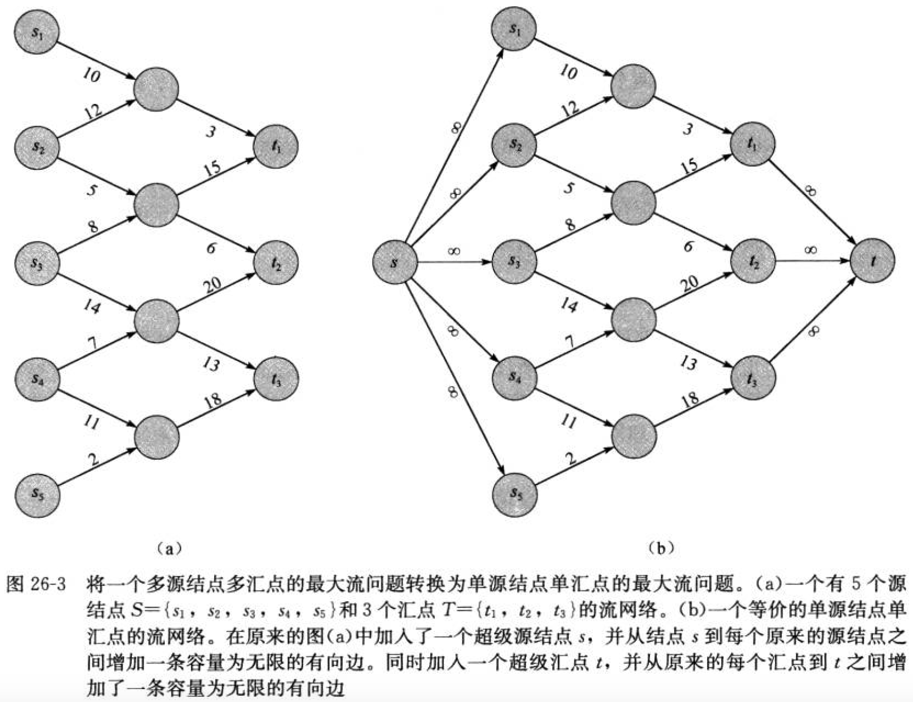

# Code_Play

Programming Practice - ACM Algorithm - Graph Theory

By [YuweiYin](https://github.com/YuweiYin)

**Max-Flow & Matching**

## 目录

- 最大流 Max-Flow
	- [Ford-Fulkerson 方法](./ford-fulkerson.py)
	- [Push-Relabel](./push-relabel.py) 推送-重贴标签方法
		- Relabel-To-Front 前置重贴标签算法
	- 结点有容量限制的网络流
	- 逃逸问题
	- 最大流的更新
	- Dinic 算法
	- 有上下界限制的最大流
	- 无向图最小切割 -> Stoer-Wagner 算法
	- 有向图和无向图的 边不相交路径
	- 含负费用的最小费用最大流
- 匹配 Matching
	- 最大二分匹配
		- Ford-Fulkerson 最大流方法
		- Hopcroft-Karp 最大二分匹配算法
	- Hungary 算法
	- 最小点覆盖
	- 最小路径覆盖
	- 最大独立集问题
	- 二分图最优完备匹配 Kuhn-Munkras 算法
	- 不带权二分匹配：匈牙利算法
	- 带权二分匹配：KM 算法
	- 一般图的最大基数匹配
	- 一般图的赋权匹配问题

## 最大流 Max-Flow

正如可以通过将道路交通图模型化为有向图 来找到从一个城市到另一个城市之间的最短(加权)路径，也可以将一个有向图看作是一个“**流网络**”并使用它来回答关于**物料流动**方面的问题。

设想一种物料从产生它的**源结点**经过一个系统，流向消耗该物料的**汇点**这样一个过程。源结点以某种稳定的**速率**生成物料，汇点则以同样的速率消耗物料。从直观上看，物料在系统中任何一个点上的“**流量**”就是物料移动的速率。

这种流网络可以用来建模很多实际问题，包括液体在管道中的流动、装配线上部件的流动、电网中电流的流动和通信网络中信息的流动等。

---

可以把流网络中每条**有向边**看作是物料的一个**流通通道**。每条通道有**限定的容量**，是物料流经该通道时的**最大速率**，如一条管道每小时可以流过 200 加仑的液体，或是一根电线可以承受 20 安培的电压，或是一根网线/光纤的通信信道容量等。

流网络中的结点则是**通信的连接点**。除了源结点和终结点外，物料在其它结点上**只是流过**，并**不累积或聚集**。也即是说，物料进入一个结点的总流量速率必须与离开该结点的总流量速率相等，此性质被称为“**流量守恒**”，这里的流量守恒与 Kirchhoff 电流守恒等价。

---

在最大流问题中，一般目标是在不违反任何 边的容量限制、结点的流量守恒定律 的前提下，计算出从源结点运送物料到汇点的最大速率。这是与流网络有关的所有问题中最简单的问题之一。此问题可以由高效的算法解决，而且，最大流算法中的一些基本技巧 可以用来解决其它许多网络流问题。

例如“推送-重贴标签”方法，是许多网络流问题的快速算法的基石。

## 流网络

流网络 G = (V, E) 是一个有向图，图中每条边 $(u, v) \in E$ 有一个**非负**的**容量值** c(u, v) >= 0。而且，如果边集合 E 包含一条边 (u, v)，则图中不存在反方向的边 (v, u)。如果 (u, v) \notin E，为方便起见，定义 c(u, v) = 0。并且在图中不允许有自循环/自圈 (u, u)。

另外，在流网络的所有结点中，有两个特殊的结点：**源结点** s (source) 和**汇点** t (terminal)。源结点入度为 0、汇点出度为 0。为方便起见，假定 V 中每个结点 v 都位于某条从 s 到 v 的路径上，即有 `s ~> v ~> t` 路径。

因此，流网络图是**弱连通**的。并且由于除源结点 s 外的每个结点都至少有一条进入的边，有 `|E| >= |V| - 1`。

- 流网络的性质主要如下：
	- 流网络 G = (V, E) 是一个弱连通的有向图
	- 所有边的权重为非负值，且每条边的权重值有上界 c(u, v)
	- 任意两个结点 $u, v \in V$，不能同时存在边 (u, v) 和边 (v, u)
	- 如果某边 (u, v) 不存在，定义其权重值 c(u, v) = 0
	- 图中没有自循环 (u, u)
	- 通常来说，源结点 s 的入度为 0，汇点 t 的出度为 0
	- 每个结点 v 都处于从 s 到 t 的某条路径上。即：从起点 s 发出的流量可以流经 v 到达终点 t

这里给出流的形式化定义。设 G = (V, E) 是一个**流网络**，其**容量函数**为 c。设 s 为网络的**源结点**，t 为**汇点**。G 中的**流**是一个**实值函数** f: VxV -> R，满足如下两条性质：

1. **容量限制**：（“流量有限额”）对于所有的结点 $u, v \in V$，要求 0 $\leq f(u, v) \leq c(u, v)$
2. **流量守恒**：（“流入等于流出”）对于所有的结点 $u \in V - \{s, t\}$，要求 $\sum_{v \in V} f(v, u) = \sum_{v \in V} f(u, v)$
	- 当 $(u, v) \notin E$ 时，从结点 u 到结点 v 之间没有流，因此 f(u, v) == 0

称非负数值 f(u, v) 为从结点 u 到结点 v 的流。一个流 f 的值 `|f|` 定义如下：

$$|f| = \sum_{v \in V} f(s, v) = \sum_{v \in V} f(v, s)$$

即，流 f 的值时从源结点流出的总流量 减去 流入源结点的总流量。这里符号 $| \cdot |$ 仅用作表达流的值，而不是数的绝对值或者集合的基数值。

通常来说，一个流网络不会有任何进入源结点的边，即源结点的入度为 0，故求和项 $\sum_{v \in V} f(v, s)$ 的值将是 0。但对于有的网络而言（比如**残存网络**），流入源结点的流量十分重要。

在**最大流问题**中，给定一个**流网络** G、一个**源结点** s、一个**汇点** t，目标是找到值最大的一个**流**。

### 反平行边

如果在实际建模流网络的有向图时，发现存在**反平行边** (antiparallel)，即同时存在边 (u, v) 和边 (v, u)，则可以通过加入一个抽象的**新结点**，来让 (u, v) 或 (v, u) 中的某条边被替换掉。例如下图所示，替换了 (v1, v2) 这条权重(流容量)为 10 的边。对最大流问题而言，这样转换后的流网络与原来的流网络等价。

### 具有多个源结点和多个汇点的流网络

流网络可以具有多个源结点、多个汇点，这种情况也是很常见的。例如源结点可能表示某家公司的生产工厂（可以有多个），汇点表示该公司的货存仓库（也可以有多个）。

具有多个源结点和多个汇点的最大流问题，并不比普通的最大流问题更难，因为可以通过加入一个抽象的**超级源结点** s 和**超级汇点** t，来让问题转化为普通的“单源点单汇点”的流网络，且两个网络在最大流问题上是等价的。

- 创建**超级源结点** s，并对于每个原本的源结点 si，添加有向边 (s, si)，并设置容量 c(s, si) = inf 无穷。
- 创建**超级汇点** t，并对于每个原本的汇点 ti，添加有向边 (ti, t)，并设置容量 c(ti, t) = inf 无穷。

### 最大流与线性规划

设 f 为网络中的一个流，设 a 为一个实数，则 af 称为 **标量流积**，它是一个从 V x V 到实数集 R 的函数，定义为 $(af)(u, v) = a \cdot f(u, v)$

可以证明，网络中的流形成一个**凸集**。如果 f1 和 f2 为两个流，则 a f1 + (1 - a) f2 也是一个流。（这里 0 <= a <= 1）

前述可以表明最大流问题的线性性质。结合思考用 [Bellman-Ford 算法](../shortest-path/bellman-ford.py) 求解线性规划中的 差分约束系统，可以类似地将最大流问题转化为一个线性规划问题。（利用 **容量限制** 和 **流量守恒** 性质）

### 结点容量限制

有时候，在实际建模流网络的有向图 G = (V, E) 时，除了边具有容量限制 c(u, v) 外，流网络可能还有**结点容量**限制。即对于每个结点 $v \in V$，有一个极限值 l(v)，表明可以流经结点 v 的最大总流量。

可以将一个带有结点容量的流网络 G = (V, E) 转换为一个等价的、没有结点容量限制的流网络 G' = (V', E')，使得 G' 中的最大流与 G 中的最大流的取值一样。

方法：对每个结点 v 进行“复制”，得到 v'，并增添边 (v, v')，其容量 c(v, v') = l(v)。然后把所有以 v 为起点的有向边 (v, ?) 改为 (v', ?)。如下图所示：

因此对于去掉了结点容量的流网络 G' = (V', E') 而言，有 $|V'| = 2 |V|$ 且 $|E'| = |E| + |V|$。（这里假定原图的 V 中每个结点都具有结点容量，因此都需拆成两份）

## 参考资料

- Introduction to Algorithm (aka CLRS) Third Edition - Chapter 26
